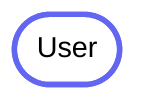
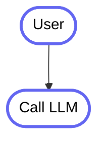
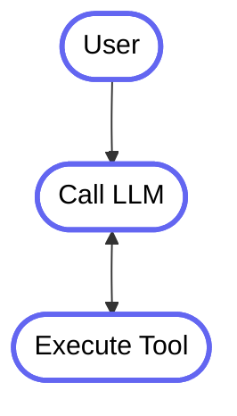
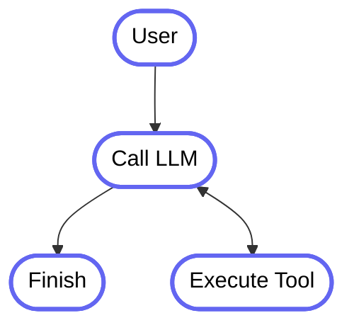

# Kotlin, Ktor & Koog

- Simon Vergauwen

---

# Kotlin, Ktor & Koog

- LLM
- Koog
    - Ktor

---

# Language Learning Model

<br>

> By analysing these vast pools of information, LLMs learn the statistical relationships between words and phrases

---

# Language Learning Model


---

# Language Learning Model


---

# Tokenization

[Tokenizer playground @ Lunary.ai](https://lunary.ai/anthropic-tokenizer)


---

# Tokenization


---

# LLM


---

# LLM: Parameters

<v-clicks>

- LLM model size is expressed in _parameters_
    - Requires more resources (Memory, CPU, GPU)
    - More expensive to train, and more data is used

- Large model can handle complex tasks.
    - Can be more creative, more diverse

- Small model can handle simple tasks.
    - Can be more deterministic, more focused

</v-clicks>

---

# LLM: Parameters

| Model       | Parameters | Memory (FP16) | Speed    | Best For                    |
|-------------|------------|---------------|----------|-----------------------------|
| Gemma 3 1B  | 1 billion  | 2GB           | Fastest  | Mobile apps, edge devices   |
| Gemma 3 4B  | 4 billion  | 8GB           | Moderate | Web applications, chatbots  |
| Gemma 3 12B | 12 billion | 24GB          | Slowest  | Research, complex reasoning |

https://ollama.com/


---

# LLM

- Deterministic? No
- Depends on training data, and thus depends on model to model
- Can contain misinformation (e.g. false positives or hallucinations)

---

# AI Kotlin Notebooks!

---

# Prompt Guide

[OpenAI GPT5 Prompt Guide](https://cookbook.openai.com/examples/gpt-5/gpt-5_prompting_guide)

---

# Context Window

- Refers to the maximum number of tokens that the model can see before making a prediction
- Be wary of large context windows!!
    - Avoid exceeding 70~80% of the maximum context window size. "red-lining"
    - 100% context window size is not recommended

---

# Context Window

- Keep focused on the task at hand
- Avoid irrelevant information, and information bloat
    - This heavily degrades results.

---

# Prompt chaining


---
layout: two-cols-header
---

# Agent

::left::



::right::

```kotlin
fun singleRunStrategy() = strategy("single_run") {
}
```

<style>
.col-left {
  width: 30%;
}
</style>

---
layout: two-cols-header
---

# Agent

::left::



::right::

```kotlin
fun singleRunStrategy() = strategy("single_run") {
    val nodeCallLLM by nodeLLMRequest()

    edge(nodeStart forwardTo nodeCallLLM)
}
```

<style>
.col-left {
  width: 30%;
}
</style>

---
layout: two-cols-header
---

# Agent

::left::



::right::

```kotlin
fun singleRunStrategy() = strategy("single_run") {
    val nodeCallLLM by nodeLLMRequest()
    val nodeExecuteTool by nodeExecuteTool()
    val nodeSendToolResult by nodeLLMSendToolResult()

    edge(nodeStart forwardTo nodeCallLLM)
    edge(nodeCallLLM forwardTo nodeExecuteTool onToolCall { true })
    edge(nodeExecuteTool forwardTo nodeSendToolResult)
    edge(nodeSendToolResult forwardTo nodeExecuteTool onToolCall { true })
}
```

<style>
.col-left {
  width: 30%;
}
</style>

---
layout: two-cols-header
---

# Agent

::left::



::right::

```kotlin
fun singleRunStrategy() = strategy("single_run") {
    val nodeCallLLM by nodeLLMRequest()
    val nodeExecuteTool by nodeExecuteTool()
    val nodeSendToolResult by nodeLLMSendToolResult()

    edge(nodeStart forwardTo nodeCallLLM)
    edge(nodeCallLLM forwardTo nodeExecuteTool onToolCall { true })
    edge(nodeCallLLM forwardTo nodeFinish onAssistantMessage { true })
    edge(nodeExecuteTool forwardTo nodeSendToolResult)
    edge(nodeSendToolResult forwardTo nodeFinish onAssistantMessage { true })
    edge(nodeSendToolResult forwardTo nodeExecuteTool onToolCall { true })
}
```

<style>
.col-left {
  width: 30%;
}
</style>

---

# Koog in Ktor

```yaml
app:
  apiKey: $OPENAI_API_KEY
  host: "$HOST:0.0.0.0"
  port: "$PORT:8080"
```

---

# Koog in Ktor

````md magic-move
```kotlin
@Serializable
data class AppConfig(
    val host: String,
    val port: Int,
    val apiKey: String,
)
```

```kotlin
@Serializable
data class AppConfig(
    val host: String,
    val port: Int,
    val apiKey: String,
)

val config = ApplicationConfig("application.yaml")
    .property("app")
    .getAs<AppConfig>()
```

```kotlin
@Serializable
data class AppConfig(
    val host: String,
    val port: Int,
    val apiKey: String,
)

val config = ApplicationConfig("application.yaml")
    .property("app")
    .getAs<AppConfig>()
```

```kotlin
@Serializable
data class AppConfig(
    val host: String,
    val port: Int,
    val apiKey: String,
)

val config = ApplicationConfig("application.yaml")
    .property("app")
    .getAs<AppConfig>()
    
fun Application.config(): AppConfig = property<AppConfig>("app")
fun Application.apiKey(): String = property<String>("app.apiKey")
```
````

---

# Ktor Server Sent Events

````md magic-move
```kotlin
fun Application.agent(config: AppConfig) {
    routing {
        sse("/summarise", HttpMethod.Post) {
        }
    }
}
```

```kotlin
fun Application.agent(config: AppConfig) {
    routing {
        sse("/summarise", HttpMethod.Post) {
            AIAgent(...) {
                install(EventHandler) {
                        onToolCallStarting { println("Calling ${it.tool.name}") }
                        onToolCallCompleted { println("Result ${it.result.toString().take(10)}") }
                }
            }
        }
    }
}
```

```kotlin
fun Application.agent(config: AppConfig) {
    routing {
        sse("/summarise", HttpMethod.Post) {
            AIAgent(...) {
                install(EventHandler) {
                        onToolCallStarting { send("Calling ${it.tool.name}") }
                        onToolCallCompleted { send("Result ${it.result.toString().take(10)}") }
                        onLLMCallCompleted {
                            it.responses.forEach {
                                if (it is Message.Assistant) send(it.content)
                            }
                        }
                }
            }
        }
    }
}
```
````

---

# Questions?

- More demo?
- Mobile <~> Ktor Architecture

---

# Koog: LLMClient

````md magic-move
```kotlin
val openAI = OpenAILLMClient(apiKey = "key")
```

```kotlin
val openAI = OpenAILLMClient(apiKey = "key")

val response: List<Message.Response> = openAI.execute(prompt("my-prompt") {
    system("You're a helpful assistant.")
    user("Tell me a Kotlin Joke!")
}, OpenAIModels.Chat.GPT5)
```

```kotlin
val openAI = OpenAILLMClient(apiKey = "key")

val response: List<Message.Response> = openAI.execute(prompt("my-prompt") {
    system("You're a helpful assistant.")
    user("Tell me a Kotlin Joke!")
}, OpenAIModels.Chat.GPT5)

for(response in responses) {
    when(response) {
        is Message.Assistant -> println(response.content)
        is Message.Tool.Call -> TODO()
    }
}
```
````

---

# Koog: Prompting

````md magic-move
```kotlin
val prompt: Prompt = prompt("my-prompt") {
    system("You're a helpful assistant.")
    user("Tell me a Kotlin Joke!")
}
```

```kotlin
val prompt: Prompt = prompt("my-prompt", params = OpenAIChatParams(
    maxTokens = 1000,
)) {
    system("You're a helpful assistant.")
    user("Tell me a Kotlin Joke!")
}
```

```kotlin
val prompt: Prompt = prompt("my-prompt", params = OpenAIChatParams(
    maxTokens = 1000,
    temperature = 0.7,
)) {
    system("You're a helpful assistant.")
    user("Tell me a Kotlin Joke!")
}
```
````
